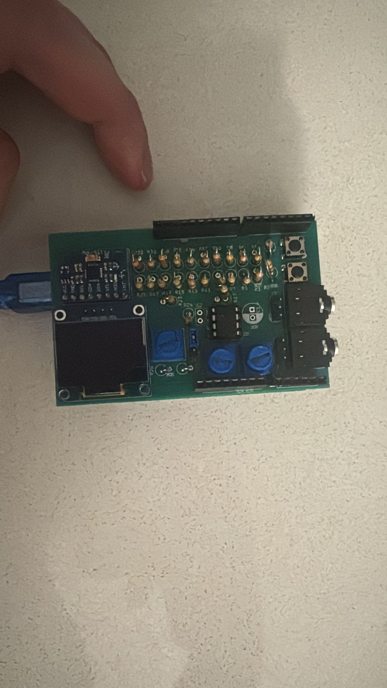
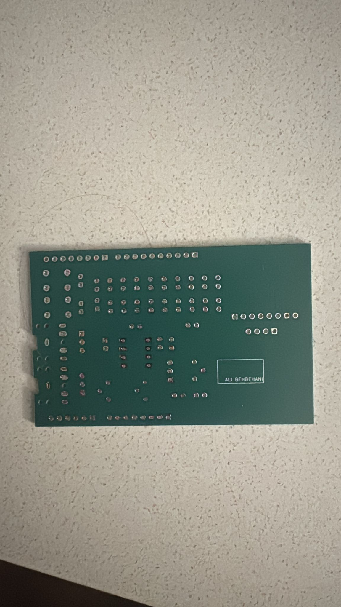

# PCB Design

## Converting Circuit to PCB

After successful prototype testing, the circuit schematic was converted into a Printed Circuit Board (PCB) layout using electronic design software.

## Schematic Design

The schematic diagram represents all electrical connections between components. It serves as the blueprint for PCB development.

## PCB Layout Process

The layout process involved:

• Placing components strategically  
• Designing copper trace paths  
• Separating analog and digital sections  
• Creating power and ground planes  

## Design Optimization

The PCB was optimized to:

• Reduce signal interference  
• Improve power distribution  
• Maintain compact board size  
• Simplify assembly process  

## PCB Top Layer

## PCB Bottom Layer

