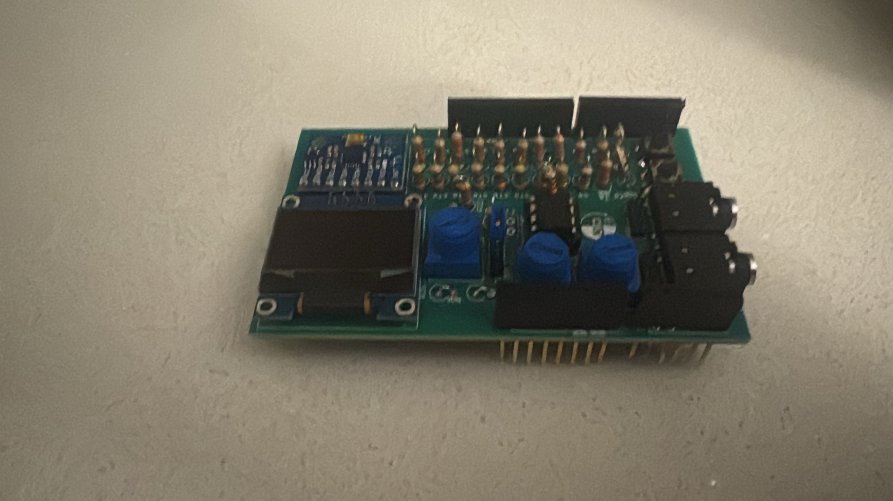

# Assembly Stage

## Component Mounting

After PCB fabrication, electronic components were mounted carefully on the board.

## Soldering Process

Soldering was performed to ensure strong electrical and mechanical connections between components and PCB pads.

## Major Installed Components

• Integrated Circuits  
• Resistors and Capacitors  
• Connectors  
• OLED Display  
• Buttons and Potentiometers  

## Inspection and Quality Check

Each component was checked for:

• Correct orientation  
• Proper solder joints  
• Absence of short circuits  
• Stable mounting  

## Final Assembled Board
## Assembled Board (Top View)

## Assembled Board (Angled View)

